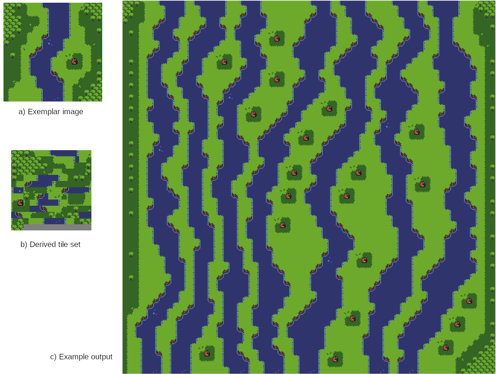
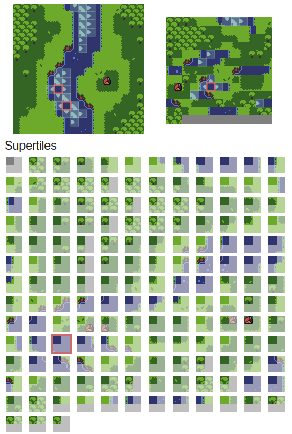
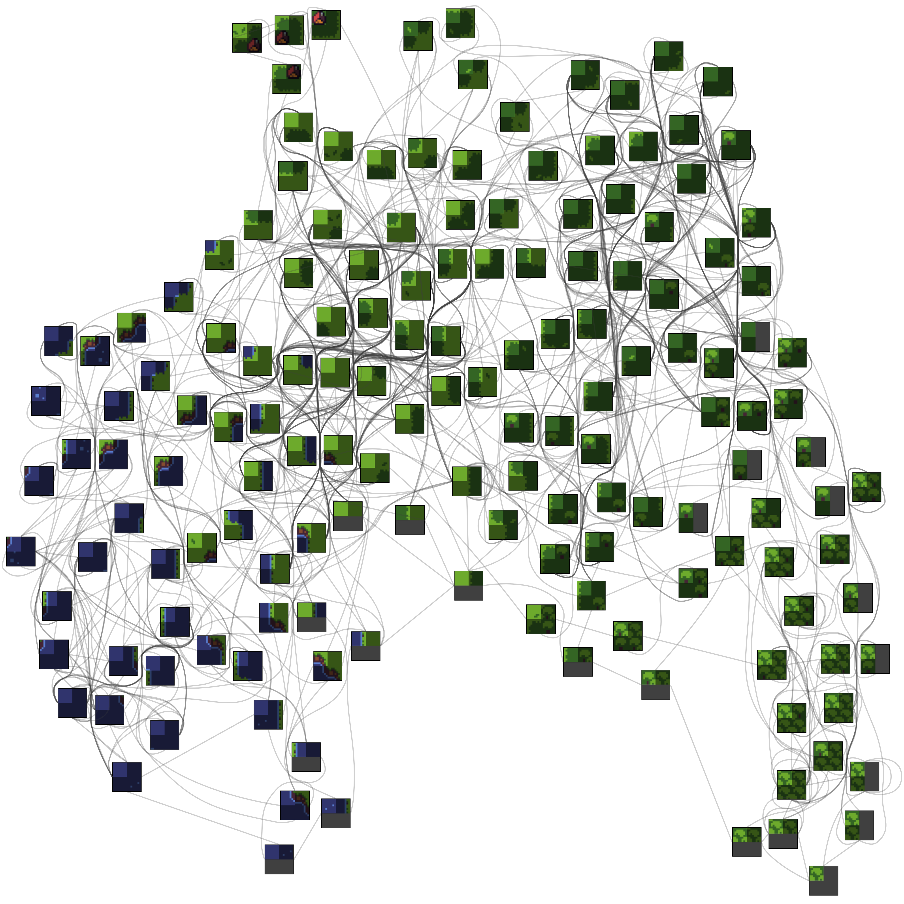

Constraint Satisfaction Problem on Tiled Regular Lattice Grids
===

Give a finite 3D lattice grid where each cell can hold one of $D$ values
subject to the constraints $C$, we want to find a valid realization
of assignments for each grid cell location that satisfies all constraints.
This is a specialization of a more general constraint satisfaction problem (CSP)
restricted to a grid with homogeneous nearest neighbor constraints.


CSPs, including the specialization considered here, are well known to
be NP-Complete in general.
In practice, many problems appear to only have weak global constraints, allowing the possibility of
better heuristics to efficiently find solutions.

Definitions
---

### Constraint Satisfaction Problem (CSP)

We will focus on the specialization of the more general constraint satisfaction problem (CSP) to
regular lattice (square/cubic) grids with identical domains for each variable and nearest
neighbor binary constraints.

* $V = \\{ V _ 0, V _ 1, \cdots, V _ N \\}$ a set of variables over the regular lattice with:
  - $N = N _ X \cdot N _ Y \cdot N _ Z$, where $x,y,z \in \mathbb{Z}$ are the dimensions of the grid
* $D = \\{ D _ 0, D _ 1, \cdots, D _ M \\}$ the domain of values each $V _ k$ can take
* $C = \\{ C _ 0, C _ 1, \cdots, C _ q \\}$ the set of constraints on the variables and values
* Variables $V _ k \in V$ have domain $D$
* Constraints are position independent, binary and only apply to pairs of neighboring grid cell positions

By convention, we write $V _ {x,y,z} = V _ k$, where $k$ is mapped onto the appropriate position
in the rectangular cuboid.

Assuming:

$$
\begin{array}{l}
  x \in \\{ 0 .. (N _ X-1) \\}, \\
  y \in \\{0 .. (N _ Y-1) \\}, \\
  z \in \\{ 0 .. (N _ Z-1) \\} \\
  \delta x, \delta y, \delta z \in \\{ -1, 0, 1 \\},  \\
  | \delta x + \delta y + \delta z | _ 0 = 1, \\
  \alpha, \beta \in \\{0..(M-1)\\} \\
\end{array}
$$

Each constraint can now be written:

$$
\begin{array}{l}
 C _ k \in C \\
 \to C _ k =  C _ {(x,y,z) \to (x+\delta x, y+\delta y, z+\delta z)} ( D _ {\alpha}, D _ {\beta} ) \\
 \to C _ k = C _ {(\delta x, \delta y, \delta z)}(D _ {\alpha}, D _ {\beta} ) \\
\end{array}
$$

For convenience, we will often refer to the constraints by an index mapped to each direction:

$$
\begin{array}{cc}
C _ 0 ( \cdot, \cdot ) = C _ {(1,0,0)}(\cdot,\cdot) & C _ 1 (\cdot, \cdot) = C _ {(-1,0,0)} (\cdot,\cdot) \\
C _ 2 ( \cdot, \cdot ) = C _ {(0,1,0)}(\cdot,\cdot) & C _ 3 (\cdot, \cdot) = C _ {(0,-1,0)} (\cdot,\cdot) \\
C _ 4 ( \cdot, \cdot ) = C _ {(0,0,1)}(\cdot,\cdot) & C _ 5 (\cdot, \cdot) = C _ {(0,0,-1)} (\cdot,\cdot) \\
\end{array}
$$

Constraint evaluations that would fall outside the finite boundary are handled as a special case.
One common resolution strategy is to use a privileged boundary domain value for the cell position
that would fall out of bounds.
Other options are wrap around conditions or some other mapping.
We will concern ourselves primarily with privileging a boundary domain value, often 0, for evaluating
constraints that would access a variable out of bounds.

That is, our standard boundary conditions are:

$$
\begin{array}{c}
V _ {(-1,y,z)} = V _ {( N _ X, y, z)} = 0 \\
V _ {(x,-1,z)} = V _ {( x, N _ Y, z)} = 0 \\
V _ {(x,y,-1)} = V _ {( x, y, N _ Z)} = 0 \\
\end{array}
$$

If we allow our constraints functions map to non-negative values, with non-zero values indicating the constraint is satisfied, and zero if the constraint is not satisfied,
then we are looking for a solution such that:

$$
\prod _ {v \in V} \prod _ { u \in \text{nei}(v) } C _ { v \to u } ( v, u ) \ \ >  \ \  0
$$


Rule Deduction From 2D Exemplars
---

A domain and constraint set can be created given an exemplar configuration.
An exemplar configuration is segmented and unique segments are cataloged to create the
domain.
Pairwise segments that appear in the exemplar configuration are then used to create
valid constraints.

| |
|---|
|  |
| Figure 1. a) The exemplar image used to deduce the tile set and tile rules b) the derived tile set c) an example output using the tile set and rules |

Figure 1 shows the process for an exemplar image.
The exemplar image is segmented into $16x16$ pixel tiles with a window of $32x32$ pixels.
The $32x32$ window create super tiles that are used to find overlapping regions to neighboring
supertiles and deduce tile rules.


| | |
|---|---|
|  |  |
| Figure 2. The exemplar image in the upper left, its derived tile set on the right and the list of supertiles underneath. The 111th super tile (index 110) is highlighted and its source location, as it appears twice, in the exemplar image is highlighted as well as its unique location in the tile set map. The neighboring tiles have also been highlighted with arrows within boxes. | Figure 3. The tile rule graph showing the connection implying the rules from the super tile for the RRTI tile set |

Figure 2 shows a list of the super tiles for this tile set along with a super tile highlighted to show where it appears in the source exemplar image and its location in the derived tile set.
Figure 3 shows a graphical representation of super tiles and their neighbors.

Note that there is a special tile, super tile 0 in Figure 2, represented by a gray tile, that is considered a boundary tile.
The exemplar image can be thought to be surrounded, outside the field of view of the exemplar image, by this distinguished tile.
The distinguished boundary tile can then be used to indicate the boundaries the desired configuration.
Any runs should remove the boundary tile from the region of interest to make sure spurious results don't occur.
As serendipity, `Tiled`, a FOSS tool to work on 2D tile sets and maps, requires tile set indices to start at 1,
allowing the use of the tile set index directly when creating `Tiled` output.

Individual tile probabilities can be created based on the frequency of tiles as seen in the exemplar.
Tile rule weightings can also be applied but this is beyond the scope of what will be discussed here.

Rule deduction from exemplar 2D images, as described in this sub section,
can be used for complex constraints that can aid in artistic styling
with minimal artistic involvement.
The construction of the tile set ($D$) and the tile rules ($C$) need not be done with exemplar images or scenes.

A limitation of example based tile and rule deduction is the exemplar must contain all patterns that are desired, as rule deduction won't
be able to infer intent.
Further, there is choice between tile size and super tile window size that must be provided to ensure pleasing results, with window
sizes too small leading to randomness and window sizes too large leading to inflexible or, in extreme cases, unique output configurations.

With these limitations in mind, often exemplar images, coupled with a window choice as described above, can provide a basis for novel
output generation that captures much of the style of the original exemplar.
Exemplars can also be created with rule deduction in mind, with exemplars tailored to enumerate tile interactions to
help guide automatic rule generation.

2D pixel images provide a good basis for automatic rule deduction as exemplar images created with an underlying tiled
approach are susceptible to overlap comparisons from pixel comparisons.
Rule deduction can be used for some classes of 3D scenes by a similar method should
they allow for a higher dimensional segmentation and overlap as in the case, for example, of a 3D voxel scene.
3D scenes with arbitrary geometry, even if they follow a cubic placement strategy, might not be as easily
amenable to automatic tile rule deduction.

##### TODO

Time permitting, automatic 3D tile rule deduction will be discussed based on geometry matching from a given 3D tile object set.


Supporting Algorithms
---

There are four main supporting algorithms that will be discussed here that provide the basis for
the experimental heuristics discussed later on.
These are:

* Wave Function Collapse (WFC)
* Merrell's Modify-in-place Model Synthesis (MMS)
* Breakout Model Synthesis (BMS)
* Punch Out Model Synthesis (POMS)

A brief overview is given below.


### Wave Function Collapse (WFC)

Gumin's Wave function collapse (WFC), as defined here, is a one-shot algorithm employing an arc consistent constraint
propagation strategy after cell tile values have been resolved.
When the configuration is in an arc consistent state, cell resolutions is chosen via a minimum entropy heuristic.

In psuedo-code:

```javascript
WaveFunctionCollapse(V):
  while V not fully realized:
    pick an unresolved cell, v, that has minimum entropy
    resolve cell v to be tile value d according to the tile values distribution at v (G(v))
    propagate constraints until a contradiction is encountered or the grid is in an arc consistent state (AC3/AC4)
    if a contradiction is encountered: return Fail
  return Success

put V in a wildcard state, allowing all tile values at every cell in V
WaveFunctionCollapse(V)
```

Here, the minimum entropy of a cell is defined to be the entropy of the single tile
distribution at the cell position $v$ :

$$
-\sum _ {d \in \text{Domain}(v)} G(d) \cdot \ln ( G(d) )
$$

Where $G(\cdot)$ is suitably normalized over the remaining domain values at that cell location.
When there is a choice of cells with equal entropy, they are chosen uniformly at random.

When choosing a cell or tile to realize, randomness can be added to add variation.

### Merrell's Modify-in-Blocks Model Synthesis

Merrell's Modify-in-Blocks Model Synthesis (MMS), as defined here, requires the grid to be in an initial
fully realized arc consistent state.
From this initial state a block is chosen and put in an indeterminate state after which some resolution
algorithm, such as WFC, is run to attempt a resolution.
If a solution inside the block is found, the block is accepted, otherwise the grid is put back into its
previous state.

The schedule of blocks to be chosen, which we will call a block choice policy, can be arbitrary, but one
common choice is to chose blocks sequentially through the grid, with half of the block region overlapping
with a previous choice.

In pseudo-code:

```javascript
ModifyInPlaceModelSynthesis(V, block_size, max_iter):
  for iteration in {0 .. (max_iter-1)}:
    save current grid state as V'
    pick a block from a given block choice policy within the grid based, of block_size size
    run WFC on the chosen block
    if ( block solution is found ):
      save block
    else:
      revert V to V'
  return Success

Find an initial fully realized state for V
ModifyInPlaceModelSynthesis(V, block_size, max_iter)
```

Though not stated explicitly, since MMS only ever works in blocks, only the current working block
need be loaded into memory as the rest of the grid has only one tile value.
This allows for an implementation that is out of core, with the possibility of only requiring
memory and other resources for the current working block.


### Breakout Model Synthesis

Breakout Model Synthesis (BMS) proceeds much like WFC accept for when a contradiction is encountered
it re-attempts to resolve until a retry limit is exceeded.
Once the retry limit has been passed, a block is chosen to put back into an indeterminate state at
which the algorithm proceeds.

In more detail, the grid is initial put into an arc consistent state, subject to initial constraints.
The indeterminate configuration is saved into a prefatory state, $V _ {\text{prefatory}}$.
The algorithm proceeds to resolve cells via some cell resolution policy and propagate constraints.
Should the maximum retry limit on failures be exceeded a soften operation is performed by choosing
a block to be put back into
its prefatory state, as stored in $V _ {\text{prefatory}}$.

A maximum iteration count can be added to ensure the algorithm doesn't work indefinitely.

In pseudo-code:

```javascript
BreakoutModelSynthesis(V, soften_size, retry_limit, max_iter):

  put V into an arc consistent state
  if V is not arc consistent: return Fail

  VPrefatory = V

  retry_count = 0
  for iter in {0 .. (max_iter-1)}:
    if V is fully resolved: return Success

    V' = V

    if retry_count == retry_limit:
      choose a block, B, of size soften_size, based on previous cell resolution choices
      # put the block in V back to its prefatory state
      V[B] = VPrefatory[B]
      put V back into an arc consistent state (run constraint propagation)
      retry_count = 0

    choose a cell, v, based on some cell choice policy
    resolve cell v to be tile value d according to the tile values distribution at v (G(v))

    try to put V into an arc consistent state
    if ( V is arc inconsistent ):
      V = V'
      retry_count ++
    else:
      retry_count = 0
      
  return Fail

Apply any initial constraints to V
BreakoutModelSynthesis(V, soften_size, retry_limit, max_iter)
```

Note that there is no check for failure of resolution after reverting the grid back once the retry
limit has been exceeded as the grid must have an arc consistent state.

The choice of soften size is critical to the proper operation of BMS.
If a soften size is chosen to be too large, this has the effect of completely resetting the grid
without saving any partial work.
If the soften size is too small, BMS can get trapped in local minima without the possibility of
escape.

A tile set is ideally conditioned for BMS when there is a finite spatial influence radius
with a soften size that encompasses it.
This effectively allows for the removal of locally contradictory regions, should they arise,
by minimizing influence to neighboring regions, allowing progress made to be kept.

BMS can still work in situations where the finite influence radius assumption is violated
but, as of this writing, its unclear to the authors what natural conditions allow
a tile sets with long range correlations to be susceptible to this method.

BMS is reminiscent of a Monte Carlo Markov Chain (MCMC) type of algorithm but has some
subtle, but important, differences from a naive MCMC implementation.
Here, the naive MCMC setup is thought to be one where only
one tile per cell is allowed, contradictions are tolerated and an energy is derived
from the number of contradictions in each cardinal direction.
A Metropolis-Hastings style algorithm can then be used to change individual cells
by rejecting or accepting individual tiles depending on the derived probability from the energy.

An abridged list of comparisons is provided here:

* At the start of every iteration, BMS is in an arc consistent state where MCMC can be in a contradictory state
* BMS propagates constraints through the entire grid after one resolution where MCMC only fixes one tile at a time
* BMS reverts a block to an indeterminate state after too many failed resolution attempts whereas MCMC only
  focuses on one cell at a time

Crucially, MCMC is much more likely to get stuck in local minima as the focus is on changing only one cell
at a time and can prevent it from escaping a tile set that has a large, but finite, influence radius.
BMS's focus on reverting a whole block to an indeterminate state allows for a whole area that could
be participating in a contradiction to be eradicated.

### Punch Out Model Synthesis

Punch Out Model Synthesis (POMS) starts with a grid in an indeterminate state and attempts
resolution on local patches.
The choice of algorithm to resolve local patches is left open but unless otherwise stated,
BMS will be used.
Each patch is undertaken independently from the rest of the grid, keeping constraint propagation
localized to the patch by restricting constraint propagation implications to the patch boundary.

If a patch can't be resolved, the grid is eroded, reverting
portions of the previously resolved grid back to an indeterminate state.
The erosion policy can be chosen to suite the problem in question.
One strategy is to probabilistically remove a portion of the resolved boundary
in the whole grid if a patch fails to find a solution.
Should a patch fail on the initial constraint propagation, one option is
to revert the whole patch completely as prospects for choosing a patch
that can get past the initial constraint propagation are bleak.

In pseudo-code:

```javascript
PunchOutModelSynthesis(V, patch_size, P_erode, max_iter):
  initialize V to be in an indeterminite state, without running constraint propagation
  
  for iter in {0 .. (max_iter-1)}:

    if V fully resolved: return Success

    choose patch, P, of size patch_size
    pin boundary values of P that don't fall on the boundary of V
    set all non pinned values to an indeterminate state in P
    run block resolution algorithm on P (e.g. BMS)
    if ( initial constraint propagation in P fails ):
      set patch P to an indeterminate state in V
    if ( P resolution failed ):
      s = ResolvedCount(V) / |V|
      revert each resolved cell in V to an indeterminate state with probability P_erode(s)
    if ( P resolution succeeded ):
      accept patch P, moving all resolved values back to the appropriate location in V
    
  return Fail

PunchOutModelSythesis(V, patch_isze, P_erode, max_iter)
```

Here, `P_erode` is a function dependent on how far the resolution has progressed so
that the aggressiveness of the erosion can be attenuated as needed.

The patch choice policy can be selected to suite the problem at hand.
One policy is to choose a patch based on regions of unresolved tiles.
Another is to choose based on unresolved tiles but with a bias towards
a point or region, such as the center point or the edges.

Different tile sets and configurations will be more responsive to different
patch choice policies.
Which patch choice policies work best is not understood well by the authors
and will be discussed more in a later section.

### Discussion and Comparision

A brief comparison of each algorithm is provided:

| Algorithm | One-Shot | In-Core/Out-of-Core | Initial Configuration | Can Fail |
|-----------|----------|---------------------|-----------------------|----------|
| Gumin's Wave Function Collapse (WFC) | yes | in core | not required | yes |
| Merrell's Modify-in-place Model Synthesis (MMS) | no | out of core | required | no |
| Breakout Model Synthesis (BMS) | no | in core | not required |  yes |
| Punch Out Model Synthesis (POMS) | no | out of core | not required | yes |

Here, the different definitions in the header are:

* **One-Shot**: whether the algorithm can recover from a found contradiction
* **In-Core/Out-of-Core**: in-core means the entire problem must reside in active memory whereas out-of-core means
  sub-problems can be wored on in blocks or patches with only the active block or patch required to be in-core
* **Initial Configuration**: whether the algorithm needs a fully resolved iniital configuration
* **Can Fail**: whether the algorithm has the possibility to fail to find a solution


WFC is a "one-shot" algorithm, alternatively fixing a cells value then propagating the implication
of the resolution until either a solution or contradiction is found.
MMS starts from an initial solution state then tries to find solutions restricted to a sub region
within the grid.
BMS attempts to find a solution, as in WFC, but reverts sub-regions into an indeterminate  state should
a enough contradiction be encountered.
POMS works on patches independently within a larger grid, with each patch pinning boundary values and
eroding boundaries or reverting patches if a patch realization can't be found.

WFC's "one-shot" nature leads to an exponentially increasing probability of reaching a contradiction
as configuration size grows.
Methods of backtracking can be employed but these can lead to long run times should a bad initial choice
be made.

A drawback of MMS is that if the block size is chosen to be smaller than an implied constrained pattern that
requires an area larger than the block size, MMS will fail to discover the pattern.
For example, if there is a pattern that requires no fewer than 20x20 cells, a run of MMS with block size 8x8
will never be able to discover it as any block discovered will need to be able to weave into the surrounding
resolved grid.
Some patterns and implied constraints can be global, further preventing any finite block choice from MMS
to find whole classes of solution.

WFC, BMS and POMS can overcome MMS's block size limitation as the grid they work on are in an indeterminate
state, but POMS provides an out-of-core solution whereas both WFC and BMS are in-core.

BMS requires a soften size and can get trapped in local minima if the soften size is too small or have
a high likely hood of failure if the soften size is too large.
Too small of a soften size, below the tile sets influence radius, if it exists, and BMS will suffer
a similar issue as the naive MCMC algorithm described above, getting trapped in a local minima without
the possibility of being able to jump out.
Too large of a soften size and BMS will suffer a similar shortcoming of WFC, as any progress will
be eradicated by too aggressive of a soften operation.
In the extreme case, a soften size of the whole grid is equivalent to resetting the problem and
trying again.

POMS works on patches independent of other areas in the grid, leading to the potential for patches
to be in a locally arc consistent state or the grid being in a contradictory state.
Since each patch is processed independently, arc consistency of the whole grid is most likely achieved
when a solution is found.
Worse, there is the possibility that the whole grid is in a contradictory state as individual
patches may be arc consistent within their resolved regions but no bridge patch exists to connect the two.
Choosing a patch size too small can lead to an inability to find solutions as independent regions
will grow and eventually collide with each other without the ability to bridge a connection, leading
to a cycle of growth and erosion without overall progress.
Choosing a patch size too large defeats the out-of-core feature as WFC or BMS can be used in such a case.

A judicious choice of patch choice policy can overcome some limitations of small patch sizes.
For example, a policy can be chosen to consistently bridge a single resolved region, but the choice of
patch size, patch choice policy and other parameters can be fragile.
The patch size and patch choice policy also can heavily bias a solution, leading to the potential
of sacrificing variety for assurances of convergence.


Note also that many methods can be combined.
WFC or BMS can be used to resolve the local blocks or patches that MMS and POMS use. 
Further, methods can be chained and used to bootstrap others.
For example, BMS or POMS can be used to find an initial valid configuration and MMS can then be used
to find other solutions, using the found solution as its initial fully realized configuration.

### CSP

Following Xu et al, here is a more general formulation of a CSP:

* variables $V = \\{ v _ 0, v _ 1, \dots , v _ {n-1} \\}$
* domains $D = \\{ D _ 0, D _ 1, \dots, D _ {n-1} \\}$, with $| D _ i | = d _ i \ge 2$
* constraints $C = \\{ c _ 0, c _ 1, \dots, c _ {m-1} \\}$
  - $c _ i = ( V _ i, R _ i )$
  - $V _ i = ( v _ {i _ 0}, v _ {i _ 1}, \dots, v _ {i _ {k _ {i} -1}} )$, where $k _ i$ is called the scope of constraint $c _ i$
  - $R _ i \subseteq D _ {i _ 0} \times D _ {i _ 1} \times \cdot \times D _ {i _ {k} -1}$, with $R _ i$ representing the valid/admissible relations
    over $V _ i$

Without loss of generality, $k _ i$ and $d _ i$ can be kept constant ($k _ i = k \in \mathbb{N}$, $d _ i = d \in \mathbb{N}$)
by padding out relations with the appropriate values to render variables out of scope redundant and restricting unwanted variable
domain combinations.
In practice it's easier to tailor the general form to the specifics of the problem, potentially considering $k _ i$ to small
and $R _ i$ defined implicitely.

References
---

* Xu W, Gong F, Zhou G. 2020. Clustering phase of a general constraint satisfaction problem model d-k-CSP. Physica A 537 (2020) 122708
