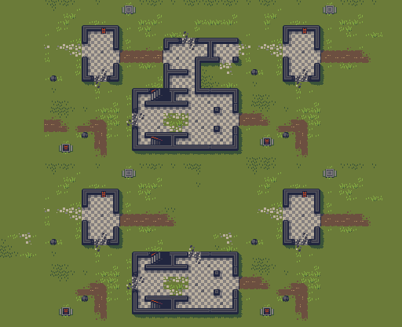

Adam Saltsman's Jawbreaker
===

* [Jawbreaker on itch.io](https://adamatomic.itch.io/jawbreaker)

Tileset license: CC0

Results
---

| Example | Sample Run |
|---|---|
|  |  |

| Simple ACCL | Frequency ACCL |
|---|---|
|  |  |

Parameters
---

```
../../bin/poms \
  -C ./data/jawbreaker_poms.json \
  -b 1 -B 8 \
  -w 2 -E -1.7 \
  -S 1337 \
  -V 2 \
  -1 ./jawbreaker_128x128.json
```

Tile set creation
---

```
node ../../src.js/img2tile.js \
  -E ./data/jawbreaker_fixed.png \
  -P ./data/jawbreaker_poms.json \
  -T ./data/jawbreaker_tileset.png \
  -t ./data/jawbreaker_flat_tileset.png \
  -M ./data/jawbreaker_tilemap.json \
  -m ./data/jawbreaker_flat_tilemap.json \
  -s 8 \
  -w 16 \
  -D 128,128,1 \
  -q 128,128,1 \
  -W flat
```

Notes
---

The exemplar image had to be hand crafted so as not to be overly restrictive.

