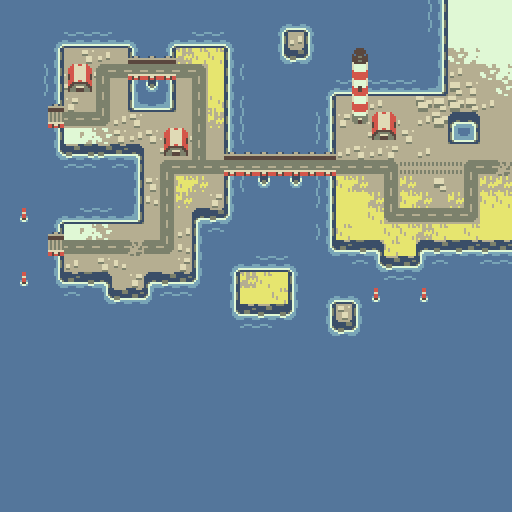

Adam Saltsman's Kyst
===

* [Kyst on itch.io](https://adamatomic.itch.io/kyst)

Tileset license: CC0

| Example | Sample Run |
|---|---|
|  |  |

| Simple ACCL | Frequency ACCL |
|---|---|
|  | |

Notes
---

Better luck with taking half tile stride (8px instead of 16px).

The boundary constraints make the tileset a bit more difficult so
convergence suffers.

