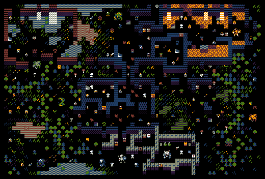
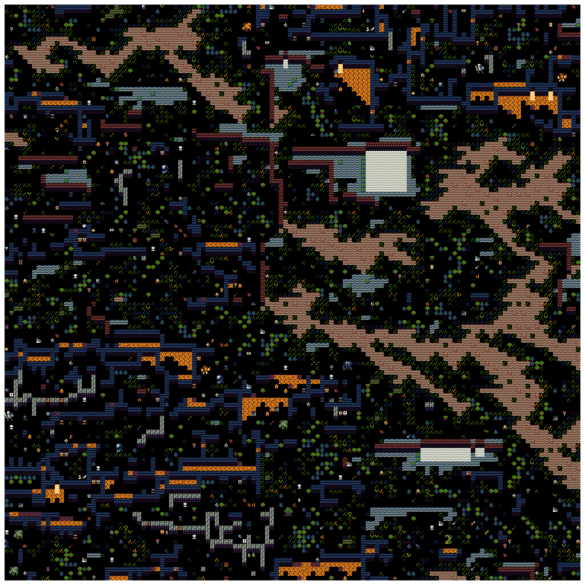

Kingel's Minirogue
===

* [Minirogue on TIGSource](https://forums.tigsource.com/index.php?topic=14166.0)

Tileset and example image license: CC-BY-SA 4.0

| Example | Sample Run |
|---|---|
|  |  |

Notes
---

Wrap around conditions were used from the modified example image (removing the frame pixel boundary).

Tile weightings of `flat`, `uniform` and `image` all work.
I picked `image` for no particular reason.
