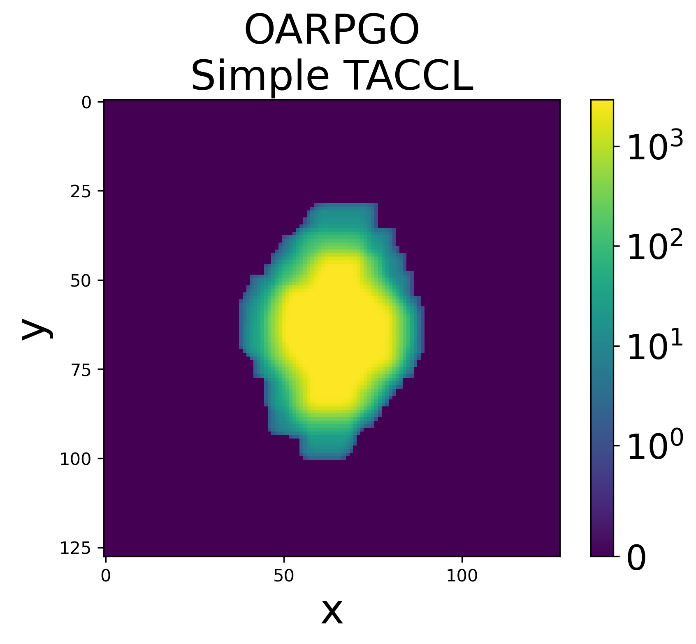

LUNARSIGNAL's Overhead Action RPG Overworld
===

* [OGA](https://opengameart.org/content/overhead-action-rpg-overworld)

LICENSE: CC-BY-SA 3.0

| Example | Sample Run |
|---|---|
|  |  |

---

| Tile Arc Consistent Correlation Length (Simple) | Tile Arc Consistent Correlation Length (Frequency) |
|---|---|
|  |  |

